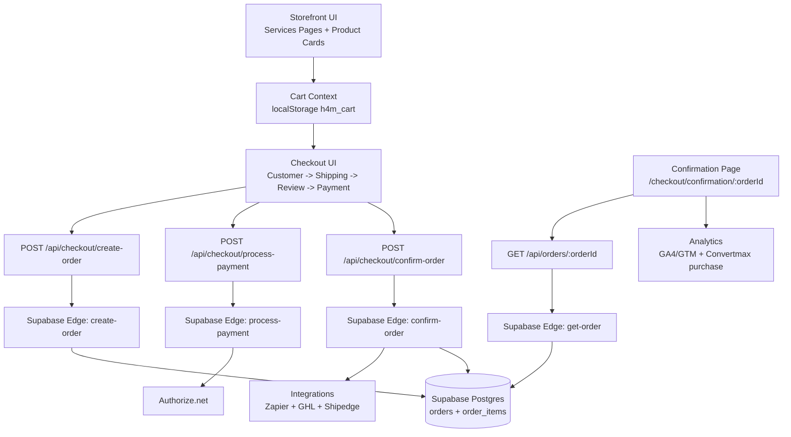

# E-commerce Architecture

## Document Status
- Last updated: 2026-06-05
- Repository: `goh4m-main`
- Scope: Product catalog, cart, checkout, payment, post-purchase integrations, and admin commerce operations

## 1. Executive Summary
The commerce system is implemented as a layered architecture:

1. `Storefront UI` in Next.js pages/components renders products, cart, and checkout UX.
2. `Next.js API routes` under `src/app/api/*` act as a backend-for-frontend (BFF) boundary.
3. `Supabase Edge Functions` hold most business logic and integration side effects.
4. `Supabase Postgres + Storage` persist catalog, orders, events, and config.
5. `External systems` handle payment and operational integrations (Authorize.net, GoHighLevel, Zapier, Shipedge).

This is a strong direction because critical logic (repricing, idempotency, fulfillment events) is server-side and not trusted to the browser.

## 2. Topology

```text
Browser (Next.js Client Components)
  -> Next.js App Router pages/components
  -> /api/* (Next.js Route Handlers, BFF)
  -> Supabase Edge Functions (/functions/v1/*)
  -> Supabase Postgres + Storage
  -> External APIs (Authorize.net, GHL, Zapier, Shipedge)
```

### 2.1 Flow Diagram



## 3. Runtime Boundaries

### 3.1 Storefront and Checkout UI (Client)
Main entry points:
- `src/app/services/h4m-labs/page.tsx`
- `src/app/services/supplements/page.tsx`
- `src/app/checkout/page.tsx`
- `src/app/checkout/confirmation/[orderId]/page.tsx`

Main UI/service components:
- `src/components/Services/LabsPricingContent.tsx`
- `src/components/Services/SupplementsTempBundles.tsx`
- `src/components/Services/SupplementsTempIndividualProducts.tsx`
- `src/components/Cart/CartButton.tsx`
- `src/components/Cart/CartSlider.tsx`
- `src/components/Checkout/*`

### 3.2 Global Cart State
- Provider wiring in `src/app/layout.tsx` via `CartProviderWrapper`.
- State implementation in `src/contexts/CartContext.tsx`.
- Persistence: localStorage key `h4m_cart`.
- Analytics hooks are emitted on cart actions.

### 3.3 BFF Layer (Next.js API Routes)
Key routes:
- `GET /api/products` -> Supabase `get-products`
- `POST /api/checkout/create-order` -> Supabase `create-order`
- `POST /api/checkout/process-payment` -> Supabase `process-payment`
- `POST /api/checkout/confirm-order` -> Supabase `confirm-order`
- `GET /api/orders/[orderId]` -> Supabase `get-order`

Admin APIs:
- Products/config/contacts mostly use `supabaseAdmin` directly.
- Orders admin routes proxy to Supabase Edge Functions (`get-orders`, `get-order`, `update-order`).

### 3.4 Domain and Integration Layer (Supabase Edge Functions)
Key commerce functions:
- `supabase/functions/get-products/index.ts`
- `supabase/functions/create-order/index.ts`
- `supabase/functions/process-payment/index.ts`
- `supabase/functions/confirm-order/index.ts`
- `supabase/functions/get-order/index.ts`
- `supabase/functions/get-orders/index.ts`
- `supabase/functions/update-order/index.ts`
- `supabase/functions/shipedge-new-order/index.ts`
- `supabase/functions/shipedge-events/index.ts`

Supporting shared utility:
- `supabase/functions/_shared/ghl-contact-resolve.ts`

### 3.5 External Services
- Authorize.net: payment tokenization and charge capture
- GoHighLevel: contact resolution, post-purchase tagging, invoice operations
- Zapier: operational webhook fanout
- Shipedge: supplement fulfillment push and shipping status callbacks

## 4. Data Model (Commerce Core)

Defined primarily in `supabase-create-database.sql`.

### 4.1 `products`
Purpose: sellable catalog items.
Notable fields:
- `category` enum-like check: `comprehensive_lab_panel`, `genetic_testing_panel`, `supplements`, `supplement_stacks`
- `price`, `badge`, `stack_details` (JSONB), `stack_sku`, `supplement_product_id`, `shipping_required`, `display_order`, `is_active`

### 4.2 `supplement_products`
Purpose: SKU-level supplement catalog used by bundle composition and fulfillment.
Notable fields:
- `sku`, `wholesale_price`, `msrp`, `is_active`

### 4.3 `supplement_stack_items`
Purpose: many-to-many join for stack composition.
Notable fields:
- `stack_product_id` -> `products.id`
- `supplement_product_id` -> `supplement_products.id`
- `quantity`

### 4.4 `orders`
Purpose: canonical order aggregate and status.
Notable fields:
- Identity and dedupe: `order_number`, `idempotency_key`
- Customer/shipping fields
- Financials: `subtotal`, `tax`, `total`
- Status: `payment_status`, `order_status`
- Fulfillment: `tracking_number`, `carrier`, `shipped_at`, `delivered_at`, `return_received_at`
- Integration observability: `payment_result`, `zapier_webhook_result`, `ghl_post_purchase_result`, `ghl_invoice_result`

### 4.5 `order_items`
Purpose: immutable line items per order.
Notable fields:
- `order_id`, optional `product_id`, `product_name`, `product_price`, `quantity`

### 4.6 `config`
Purpose: dynamic runtime config for webhook/integration routing.
Notable keys seeded:
- `ZAPIER_WEBHOOK_URL`
- `NETLIFY_FUNCTIONS_URL`
- `SUPPLEMENT_POST_PURCHASE_WEBHOOK_URL`
- `SHIPEDGE_NEW_ORDER_URL`

### 4.7 `order_events`
Purpose: append/update event log for integration attempts and responses (important for retries and diagnostics).

### 4.8 Contact Sync Tables
From migrations:
- `contacts` (includes `gh_contact_id`, email, tags/custom fields snapshots)
- `form_submissions`

## 5. End-to-End Flows

## 5.1 Catalog Fetch and Render
1. Services components call `getProductsCached()` in `src/lib/products-client.ts`.
2. Client fetches `GET /api/products`.
3. API route calls Supabase Edge `get-products` with service role credentials.
4. Edge function queries active products, includes stack relationships, groups by category, sorts by `display_order` then `created_at`, caches in-memory.
5. Storefront components render category-specific cards and add-to-cart actions.

## 5.2 Cart Lifecycle
1. Product card calls `addToCart`.
2. `CartContext` normalizes quantity and updates in-memory state.
3. Cart is persisted to `localStorage` (`h4m_cart`).
4. Cart icon/slider reflect item count and total.
5. User can adjust quantity, remove items, proceed to `/checkout`.

## 5.3 Checkout and Order Creation
1. Checkout page orchestrates steps:
   - customer info
   - conditional shipping (if any item has `shipping_required`)
   - review
   - payment
2. On submit, page calls:
   - `POST /api/checkout/create-order`
   - `POST /api/checkout/process-payment`
   - `POST /api/checkout/confirm-order`
3. `create-order` edge function:
   - server-side reprices every item from active product data
   - returns `409 PRICE_MISMATCH` with `priceUpdates` when cart prices are stale
   - computes idempotency key from authoritative cart + customer + total
   - resolves duplicate/retry behavior for pending vs paid orders
   - inserts/updates `orders` and `order_items`

## 5.4 Payment Processing
1. Client uses Accept.js in `PaymentForm` to tokenize card data (opaque token).
2. `process-payment` edge function:
   - loads order and order_items from DB
   - uses DB total as authority
   - calls Authorize.net `authCaptureTransaction`
   - stores structured `payment_result` JSONB
   - returns `transactionId` on success

## 5.5 Order Confirmation and Side Effects
`confirm-order` edge function:
1. Updates order to `payment_status = paid`, `order_status = processing`.
2. Loads config keys from `config` table.
3. Builds normalized webhook payload.
4. Fanout logic (conditional by product/category/config):
   - Zapier webhook
   - Supplement post-purchase webhook
   - Shipedge new order push with retries and `order_events` persistence
   - GHL contact resolve + GHL invoice flow
   - Netlify `ghl-post-purchase` call for tags/custom field updates
5. Stores outcome payloads back on `orders` and `order_events`.

## 5.6 Confirmation Page and Conversion Tracking
1. `/checkout/confirmation/[orderId]` calls `GET /api/orders/[orderId]`.
2. `get-order` edge function returns order + items (+ optional `ghl_contact_id` from contacts match).
3. Client pushes:
   - GA4/GTM `purchase`
   - Convertmax `convert` event (deduped by session storage + refs)

## 6. Admin Commerce Architecture

### 6.1 Auth Pattern
- Admin login route writes token data into `admin_users` table and returns token.
- Frontend stores token in localStorage (`admin_token`) and sends bearer token on admin API calls.
- `requireAdmin` validates token format and resolves user/role from DB.

### 6.2 Product Management
- Admin UI: `src/app/admin/products/page.tsx`
- CRUD APIs:
  - `src/app/api/admin/products/route.ts`
  - `src/app/api/admin/products/[productId]/route.ts`
  - `src/app/api/admin/supplement-products/route.ts`
  - `src/app/api/admin/supplement-stack-items/route.ts`
- Product image upload:
  - `src/app/api/admin/product-images/route.ts`
  - Stores in Supabase Storage bucket `product-images`

### 6.3 Order Management
- Admin UI:
  - `src/app/admin/orders/page.tsx`
  - `src/app/admin/orders/[orderId]/page.tsx`
- APIs:
  - `src/app/api/admin/orders/route.ts` -> `get-orders`
  - `src/app/api/admin/orders/[orderId]/route.ts` -> `get-order`, `update-order`

### 6.4 Config Management
- Admin UI: `src/app/admin/config/page.tsx`
- APIs:
  - `src/app/api/admin/config/route.ts`
  - `src/app/api/admin/config/[configId]/route.ts`

## 7. Analytics and Eventing

Implemented in:
- `src/lib/gtmEcommerce.ts`
- `src/lib/convertmaxEcommerce.ts`
- `src/lib/convertmaxBeginCheckout.ts`
- `src/lib/convertmaxOrderConfirmation.ts`
- `docs/TRACKING.md`

Core events:
- `add_to_cart`
- `begin_checkout`
- `purchase`
- Convertmax equivalents for add cart, checkout started, and order completed

## 8. Configuration and Secret Ownership

## 8.1 Browser-exposed env (`NEXT_PUBLIC_*`)
Used for:
- Supabase URL and anon key for client-side calls
- Authorize.net Accept.js client credentials
- GTM/GA4/Convertmax routing

## 8.2 Server-only env / secrets
Used in Next routes and/or Edge functions:
- `SUPABASE_SERVICE_ROLE_KEY`
- `AUTHORIZE_NET_TRANSACTION_KEY`
- `GHL_API_KEY`, `GHL_LOCATION_ID`
- `SHIPEDGE_*` secrets
- Optional internal webhook secrets

## 8.3 Dynamic runtime config in DB
`config` table controls operational integration URLs and enable flags without redeploy.

## 9. Reliability Patterns in Place
- Server-side authoritative pricing during checkout.
- Idempotency key generation to avoid duplicate successful orders.
- Conditional shipping validation.
- Dedicated `order_events` logging for integration attempts.
- Retry loops for selected integration calls (not all paths).
- Generic error responses to frontend for safer UX/security.

## 10. Known Architecture Gaps and Risks

1. **Bug risk in `create-order` logging**
- `supabase/functions/create-order/index.ts` references `productId` in logs, but that variable is not defined in scope.

2. **Status spelling mismatch risk**
- Schema allows `cancelled`, but `shipedge-events` may write `canceled`.

3. **Multiple storefront variants**
- Current production-like pages use temp components (`SupplementsTemp*`) while legacy underscore routes still exist (`/services/_supplements`, `/services/_supplement-stacks`), which can confuse ownership.

4. **Unused/dead code paths**
- `src/app/api/webhooks/zapier/route.ts` is currently not wired for active webhook sending logic.
- `src/lib/checkout/idempotency.ts` appears unused; idempotency logic is duplicated in edge function.
- `src/lib/supabase/config-loader.ts` appears unused; config is read directly inside edge functions/admin APIs.

5. **Admin auth maturity**
- LocalStorage bearer token pattern is functional but not the strongest production model compared with HttpOnly cookie session architecture.

6. **Schema drift risk**
- `admin_users` is used by code paths but is not declared in the SQL files included in this repository snapshot.

## 11. Recommended Target Architecture (Incremental)

1. Keep the current layering model (UI -> BFF -> Edge -> DB -> Integrations).
2. Consolidate all commerce domain logic in Supabase edge functions and avoid logic duplication in Next API routes.
3. Standardize order state transitions in one state machine module (single source for allowed transitions and status values).
4. Consolidate storefront variants:
   - choose one supplements page family
   - archive or remove legacy underscore routes/components
5. Normalize integration adapters:
   - shared retry, error classification, and event logging utility
   - typed payload contracts per integration
6. Improve auth boundary for admin:
   - migrate to HttpOnly session cookies and token rotation
7. Add architecture tests:
   - checkout repricing conflict tests
   - idempotency tests
   - confirm-order fanout tests (mock external dependencies)

## 12. Suggested Read Order for New Developers
1. `src/contexts/CartContext.tsx`
2. `src/components/Services/LabsPricingContent.tsx`
3. `src/components/Services/SupplementsTempBundles.tsx`
4. `src/components/Services/SupplementsTempIndividualProducts.tsx`
5. `src/app/checkout/page.tsx`
6. `src/components/Checkout/PaymentForm.tsx`
7. `src/app/api/checkout/*`
8. `supabase/functions/create-order/index.ts`
9. `supabase/functions/process-payment/index.ts`
10. `supabase/functions/confirm-order/index.ts`
11. `supabase/functions/get-order/index.ts`
12. `supabase-create-database.sql`
13. `src/app/admin/products/page.tsx`
14. `src/app/admin/orders/page.tsx`
15. `src/app/admin/config/page.tsx`
16. `docs/TRACKING.md`

## 13. Quick File Map
- UI root provider: `src/app/layout.tsx`
- Cart domain: `src/contexts/CartContext.tsx`
- Product client cache: `src/lib/products-client.ts`
- Checkout page: `src/app/checkout/page.tsx`
- Confirmation page: `src/app/checkout/confirmation/[orderId]/page.tsx`
- Checkout API routes: `src/app/api/checkout/*`
- Order API route: `src/app/api/orders/[orderId]/route.ts`
- Admin APIs: `src/app/api/admin/*`
- Supabase functions: `supabase/functions/*`
- Schema: `supabase-create-database.sql`
- Tracking doc: `docs/TRACKING.md`
