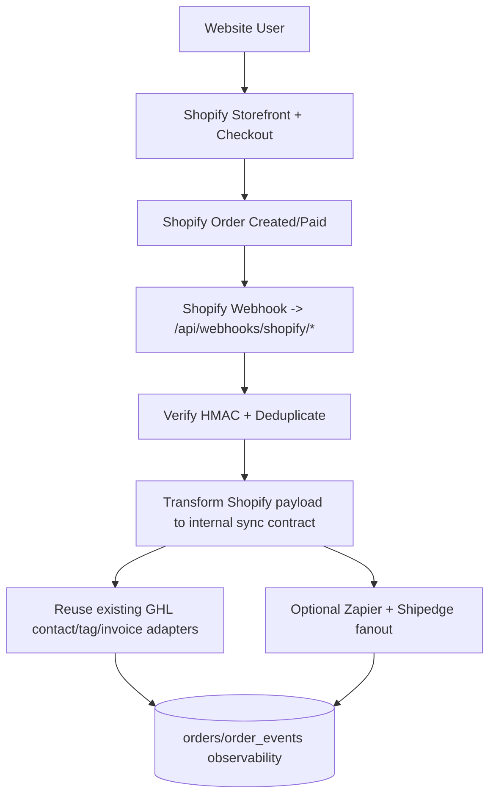

# Explorations: Shopify -> GHL Sync vs Existing Sync

## 1. Objective
Evaluate how Shopify-to-GoHighLevel (GHL) sync should be done for this codebase, compare it against the current sync implementation, and recommend a migration path with minimal regression risk.

## 2. Existing Sync (Current Repo)
Current flow is event-driven from your custom checkout confirmation path:

1. Payment is confirmed in `supabase/functions/confirm-order/index.ts`.
2. GHL contact is resolved once (DB ID validate -> GHL search -> create -> duplicate fallback) via `supabase/functions/_shared/ghl-contact-resolve.ts`.
3. GHL invoice is created via `supabase/functions/ghl-create-invoice/index.ts`.
4. GHL post-purchase tags/custom field update runs via `netlify/functions/ghl-post-purchase.ts`.
5. Each downstream action is tracked in `order_events`; duplicates are skipped using insert-first + unique constraint handling (`code === "23505"` checks).

Observed strengths in current implementation:
- Clear orchestration and retries for external calls.
- Shared contact resolution strategy used before invoice and tag update.
- Strong observability (`orders.ghl_*_result` + `order_events` history).
- Extensible fanout (Zapier, Shipedge, invoice, post-purchase tags).

## 3. Shopify -> GHL Sync Options

## Option A: Native HighLevel Shopify Integration (no custom bridge)
What this is:
- Connect Shopify inside HighLevel using its integration flow (now OAuth-led for new setups).
- Configure imports and ongoing sync settings in HighLevel UI.

Pros:
- Fastest initial setup.
- Low engineering effort.

Cons for your architecture:
- Control is mostly inside HighLevel UI/workflows, not your code.
- Mapping/custom logic parity with your current `confirm-order` orchestration is limited.
- Notes/limitations from HighLevel docs include behavior constraints (for example product tax mapping note, order status mapping to Completed/Cancelled in synced records, and trigger changes over time).

Best when:
- You only need basic CRM sync and simple automation.

## Option B: Shopify Webhook Bridge -> Reuse Existing GHL Paths (recommended)
What this is:
- Shopify becomes commerce source of truth (cart/checkout/order).
- Your app receives Shopify webhooks, verifies signature, deduplicates deliveries, then calls your existing GHL paths (or refactored shared services).

Pros:
- Maximum control and parity with your current behavior.
- Keeps your existing event logging/retry patterns.
- Easier to preserve custom tagging, invoice behavior, Zapier payload shape, and Shipedge conditions.

Cons:
- More engineering than native HighLevel integration.
- Requires webhook infra, idempotency store, and monitoring.

Best when:
- You want Shopify checkout plus your current downstream business logic quality.

## 4. Side-by-Side Comparison

| Dimension | Existing Sync (Now) | Shopify -> GHL Native (HighLevel UI) | Shopify Webhook Bridge (Recommended) |
|---|---|---|---|
| Commerce trigger source | `confirm-order` in Supabase | HighLevel-managed Shopify sync | Shopify webhooks in your app |
| GHL contact logic control | Full (custom resolver) | Low/medium | Full |
| GHL tags + custom field behavior | Full control (`ghl-post-purchase`) | Limited to what HL integration/workflows expose | Full (reuse current function/logic) |
| GHL invoice creation logic | Full control (`ghl-create-invoice`) | Not parity by default | Full (trigger from `orders/paid`) |
| Idempotency model | Existing `order_events` + duplicate checks | HL managed, not code-visible | Full control using webhook IDs + event log |
| Retry/observability | Strong in code + DB | Limited visibility in app code | Strong in code + DB |
| Engineering effort | Already done | Low | Medium |
| Fit for your current architecture | Current baseline | Partial | Best fit |

## 5. Shopify Event Plan That Matches Current Sync
Recommended initial webhook topics:
- `orders/paid` -> primary trigger for GHL invoice + post-purchase tags.
- `orders/fulfilled` -> fulfillment lifecycle updates (if needed downstream).
- `orders/updated` -> changes/adjustments sync path.
- Optional: `orders/cancelled` for cancellation/reversal workflows.

Why this set:
- `orders/paid` maps closest to current "after payment success" trigger in `confirm-order`.
- Other topics help keep downstream systems aligned after order lifecycle changes.

## 6. Payload Mapping (Shopify Order -> Current `ghl-post-purchase` Request)
Current function expects:
- `email`
- `contactId` (optional)
- `items[]` with `category`, `productName`, `quantity`
- `order_number`
- `order_total`
- `customer` object
- `address` object

Suggested mapping:

| `ghl-post-purchase` field | Shopify source (order payload) | Notes |
|---|---|---|
| `email` | `customer.email` (fallback `email`) | Required for contact search/create fallback. |
| `order_number` | `name` (or `order_number`) | Use one stable display format consistently. |
| `order_total` | `current_total_price` | Parse to number. |
| `items[].productName` | `line_items[].title` | Keep readable product title. |
| `items[].quantity` | `line_items[].quantity` | Integer. |
| `items[].category` | `line_items[].product_type` or mapped metafield | Add mapping table for your legacy categories. |
| `customer.first_name` | `customer.first_name` | Optional but useful for upsert quality. |
| `customer.last_name` | `customer.last_name` | Optional but useful for upsert quality. |
| `customer.phone` | `phone` or `customer.phone` | Normalize before forwarding if needed. |
| `address.line1` | `shipping_address.address1` | |
| `address.line2` | `shipping_address.address2` | |
| `address.city` | `shipping_address.city` | |
| `address.state` | `shipping_address.province_code` | |
| `address.zip` | `shipping_address.zip` | |
| `address.country` | `shipping_address.country_code` | |

Important gap to plan:
- Your tag logic depends on legacy categories such as `comprehensive_lab_panel` and `genetic_testing_panel`. Shopify should carry equivalent category signals (product type, tag, or metafield), otherwise tagging behavior changes.

## 7. Recommended Target Architecture

## 8. Migration Impact on Existing Components

Keep and reuse:
- `netlify/functions/ghl-post-purchase.ts`
- `supabase/functions/_shared/ghl-contact-resolve.ts`
- `supabase/functions/ghl-create-invoice/index.ts`
- `order_events` tracking pattern

Refactor/replace trigger source:
- Replace `confirm-order` as the primary trigger with Shopify webhook handlers:
  - `src/app/api/webhooks/shopify/orders-paid/route.ts`
  - `src/app/api/webhooks/shopify/orders-fulfilled/route.ts`
  - `src/app/api/webhooks/shopify/orders-updated/route.ts`

Deprecate after stabilization:
- Old custom payment/confirm flow (`create-order`, `process-payment`, `confirm-order`) for new traffic.

## 9. Risks and Mitigations

1. Duplicate webhook deliveries.
Mitigation: Persist and reject already-seen `X-Shopify-Webhook-Id`; use `X-Shopify-Event-Id` for correlation.

2. Signature validation failures.
Mitigation: Verify `X-Shopify-Hmac-Sha256` using raw request body before parsing.

3. Category/tag behavior drift.
Mitigation: Define explicit Shopify category/metafield -> legacy category mapping table before cutover.

4. Slow webhook processing and dropped subscriptions.
Mitigation: Return fast 2xx, queue async work, retry internally, and monitor failure rates.

5. Partial parity if using only native HighLevel integration.
Mitigation: Use webhook bridge for critical custom logic (invoice/tags/Shipedge/Zapier).

## 10. Recommendation
Primary recommendation:
- Use **Shopify webhook bridge** as the main sync strategy.
- Optionally keep native HighLevel Shopify integration only for non-critical convenience sync/reporting, not as the source of truth for your core automations.

This gives you Shopify checkout simplicity while preserving the maturity of your current integration logic and observability.

## 11. Sources
Shopify (official):
- https://shopify.dev/docs/apps/build/webhooks/verify-deliveries
- https://shopify.dev/docs/apps/build/webhooks/delivery-structure
- https://shopify.dev/docs/api/admin-graphql/latest/enums/WebhookSubscriptionTopic
- https://shopify.dev/docs/api/storefront/latest/objects/Cart

HighLevel (official support/docs):
- https://help.gohighlevel.com/support/solutions/articles/48001203620-how-to-integrate-shopify-with-highlevel

Codebase references:
- `supabase/functions/confirm-order/index.ts`
- `supabase/functions/_shared/ghl-contact-resolve.ts`
- `supabase/functions/ghl-create-invoice/index.ts`
- `netlify/functions/ghl-post-purchase.ts`
