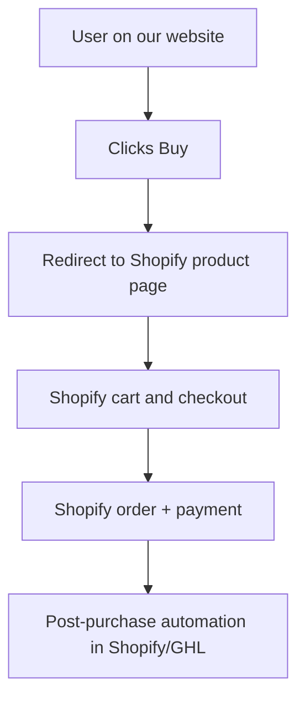

# Shopify Migration Guide (Easy Path: Redirect to Store)

## 1. Purpose
This guide documents the simpler migration path we are now choosing:
- Keep product discovery/listing on this website.
- Redirect users to Shopify store product pages for cart, checkout, and payment.
- Avoid a heavy headless rebuild for now.

Decision date: June 10, 2026.

## 2. Final User Flow We Are Implementing

In simple terms:
- Your site becomes the marketing and product info layer.
- Shopify becomes the transaction layer.

## 3. What We Are NOT Doing in Phase 1
- No Shopify headless Storefront API migration.
- No custom Shopify cart inside this app.
- No custom checkout replacement in this app.
- No large webhook bridge build on day 1.

This keeps risk and engineering effort low.

## 4. Execution Plan (2 Weeks)

## Week 1: Store Readiness + Link Mapping
### Goals
- Shopify store is fully sell-ready.
- Every product shown on this site has a Shopify destination URL.

### Tasks
- [ ] Verify Shopify product catalog (titles, prices, variants, images, inventory).
- [ ] Verify Shopify checkout settings (shipping, tax, payment gateways).
- [ ] Create a mapping file/table:
  - local product identifier -> Shopify product URL/handle.
- [ ] Decide redirect behavior:
  - open in same tab (recommended), or new tab.
- [ ] Add a global config flag:
  - `NEXT_PUBLIC_USE_SHOPIFY_REDIRECT=true|false`
- [ ] Add optional fallback URL for store homepage:
  - `NEXT_PUBLIC_SHOPIFY_STORE_URL`

### Exit Criteria
- [ ] 100% product mapping completed.
- [ ] Test product redirects land on correct Shopify page.

---

## Week 2: UI Wiring + QA + Cutover
### Goals
- Buy flow is switched from local checkout to Shopify redirect.

### Tasks
- [ ] Update product CTA buttons to redirect to Shopify product URLs.
- [ ] Add clear label near CTA, for example: "Secure checkout on Shopify".
- [ ] Hide or disable local checkout entry points for migrated products:
  - cart button/drawer if no longer used
  - `/checkout` pathway for new traffic
- [ ] Keep a temporary fallback switch to old flow (`NEXT_PUBLIC_USE_SHOPIFY_REDIRECT=false`).
- [ ] QA desktop + mobile redirect flow.
- [ ] Validate analytics continuity (`begin_checkout`, `purchase` strategy updates if needed).

### Exit Criteria
- [ ] User can move from website listing -> Shopify product -> Shopify checkout without friction.
- [ ] No production orders depend on local payment path for migrated products.

## 5. Repo-Level Change List

Minimum code changes first:
- `src/components/Services/LabsPricingContent.tsx`
- `src/components/Services/SupplementsTempBundles.tsx`
- `src/components/Services/SupplementsTempIndividualProducts.tsx`
- `src/components/Cart/CartButton.tsx` (if you want to hide/replace)
- `src/components/Cart/CartSlider.tsx` (if no longer needed)

Suggested new config source:
- `src/lib/shopify-store-links.ts` (product-to-URL mapping)

Optional cleanup after stabilization:
- `src/app/checkout/page.tsx`
- `src/components/Checkout/*`
- `src/app/api/checkout/*`
- `supabase/functions/create-order`
- `supabase/functions/process-payment`
- `supabase/functions/confirm-order`

## 6. GHL Sync in Easy Path
For the easy path, prefer this order:

1. Start with Shopify + GHL native integration for basic contact/order sync.
2. Keep custom webhook bridge as Phase 2 only if business needs deeper parity.

This avoids overengineering at launch.

## 7. Risks and Mitigations
1. Product link mismatch.
Mitigation: maintain a single mapping table and pre-launch click test every SKU.

2. User confusion during redirect.
Mitigation: add clear CTA text: "Checkout continues on our secure Shopify store."

3. Analytics drop during domain change.
Mitigation: validate cross-domain tracking and compare conversion baseline before/after cutover.

4. Old checkout still reachable.
Mitigation: feature-flag gate and route guard for migrated products.

## 8. Rollback Plan
If issues happen:
- [ ] Set `NEXT_PUBLIC_USE_SHOPIFY_REDIRECT=false`.
- [ ] Re-enable previous local checkout path temporarily.
- [ ] Fix mapping/UX issues, then re-enable redirect.

## 9. Definition of Done
- [ ] Product discovery happens on this website.
- [ ] Purchase flow happens in Shopify store.
- [ ] Team can manage products/orders from Shopify admin.
- [ ] Legacy checkout is no longer primary path.

## 10. Future Upgrade Path (Optional)
After stable redirect launch, you can choose:
1. Keep this simple model long-term.
2. Upgrade later to headless Shopify cart + checkout URL generation.
3. Add advanced Shopify webhook bridge to replicate all current custom automations.
