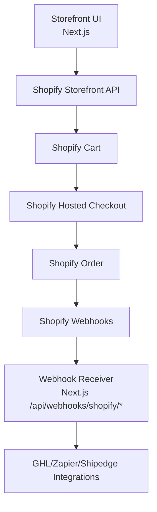

# Shopify Migration Guide (Granular Plan)

## 1. Purpose
This document is the implementation playbook to replace the current custom e-commerce flow with Shopify while keeping the existing Next.js website.

Target outcome:
- Product browsing remains on this site.
- Cart + checkout are powered by Shopify (headless).
- Payments are handled by Shopify checkout.
- Post-purchase automations (GHL/Zapier/Shipedge) are triggered from Shopify webhooks.

## 2. Current State (What We Are Replacing)
Current commerce flow uses:
- Custom cart in `src/contexts/CartContext.tsx`
- Custom checkout UI in `src/app/checkout/page.tsx`
- Accept.js payment form in `src/components/Checkout/PaymentForm.tsx`
- Custom checkout APIs in:
  - `src/app/api/checkout/create-order/route.ts`
  - `src/app/api/checkout/process-payment/route.ts`
  - `src/app/api/checkout/confirm-order/route.ts`
- Supabase edge commerce functions in:
  - `supabase/functions/create-order/index.ts`
  - `supabase/functions/process-payment/index.ts`
  - `supabase/functions/confirm-order/index.ts`

## 3. Target State Architecture

Key principle:
- Custom order/payment creation is removed from this app.
- Shopify becomes system of record for commerce transactions.

## 4. Migration Strategy
Use a phased rollout with feature flags.

- Phase 0: Prep + discovery
- Phase 1: Shopify catalog + data mapping
- Phase 2: Storefront integration (products + cart)
- Phase 3: Checkout switch to Shopify
- Phase 4: Webhooks + post-purchase integrations
- Phase 5: UAT + reconciliation
- Phase 6: Cutover + decommission old flow

## 5. Feature Flags (Required)
Create runtime flags before touching behavior:
- `NEXT_PUBLIC_USE_SHOPIFY_COMMERCE=true|false`
- `NEXT_PUBLIC_USE_SHOPIFY_CHECKOUT=true|false`
- `SHOPIFY_WEBHOOKS_ENABLED=true|false`

Default for initial merge: all `false`.

## 6. Detailed Phase Plan

## Phase 0: Discovery and Design (2-4 days)
### Deliverables
- Final Shopify product model mapping
- Bundles decision (native app vs custom mapping)
- Fulfillment decision (Shopify fulfillment vs Shipedge bridge)
- Environment/secrets matrix

### Tasks
- [ ] Confirm whether supplements, lab panels, and stacks are all physical products in Shopify.
- [ ] Define category mapping:
  - `comprehensive_lab_panel`
  - `genetic_testing_panel`
  - `supplements`
  - `supplement_stacks`
- [ ] Decide stack representation:
  - Option A: Shopify Bundles app
  - Option B: Bundle product + component metadata (metafields)
- [ ] Decide if Shipedge remains downstream.
- [ ] Document tax/shipping behavior in Shopify admin.

### Exit Criteria
- [ ] Signed-off mapping doc.
- [ ] Shopify app scopes approved.
- [ ] Implementation backlog finalized.

---

## Phase 1: Shopify Setup and Catalog Migration (3-7 days)
### Deliverables
- Shopify store configured
- Catalog migrated with images/SKUs/prices/inventory
- Test products visible via Storefront API

### Tasks
- [ ] Create Shopify custom app.
- [ ] Enable Storefront API access.
- [ ] Configure Admin API scopes (products, orders, webhooks, inventory, etc.).
- [ ] Export current product data from Supabase.
- [ ] Transform data to Shopify import format.
- [ ] Import products and validate:
  - title/description
  - images
  - variant SKU and price
  - inventory and shipping flags
- [ ] Create metafields for legacy attributes (if needed):
  - category
  - badge
  - stack metadata

### Exit Criteria
- [ ] 100% products migrated.
- [ ] Sample orders can be placed in Shopify admin test mode.

---

## Phase 2: Storefront API Integration (5-10 days)
### Deliverables
- New Shopify product client in app
- Shopify cart creation and line operations
- Existing pages render from Shopify data

### New files to add
- `src/lib/shopify/client.ts`
- `src/lib/shopify/queries.ts`
- `src/lib/shopify/cart.ts`
- `src/types/shopify.ts`

### Files to update
- `src/components/Services/LabsPricingContent.tsx`
- `src/components/Services/SupplementsTempBundles.tsx`
- `src/components/Services/SupplementsTempIndividualProducts.tsx`
- `src/contexts/CartContext.tsx`

### Tasks
- [ ] Add Shopify Storefront GraphQL client.
- [ ] Replace `/api/products` reads with Storefront API queries.
- [ ] Store Shopify variant IDs in cart items.
- [ ] Implement cart operations:
  - `cartCreate`
  - `cartLinesAdd`
  - `cartLinesUpdate`
  - `cartLinesRemove`
- [ ] Persist Shopify cart ID in localStorage.
- [ ] Keep existing cart drawer UX, but back it with Shopify cart data.

### Exit Criteria
- [ ] Add/remove/update cart works.
- [ ] Totals match Shopify cart totals.
- [ ] Product cards still render correctly on all commerce pages.

---

## Phase 3: Checkout Replacement (3-5 days)
### Deliverables
- Checkout redirects to Shopify hosted checkout.
- Old payment flow is disabled by flag.

### Files to update
- `src/app/checkout/page.tsx`
- `src/components/Checkout/PaymentForm.tsx` (remove usage)
- `src/components/Checkout/OrderReview.tsx` (if needed for pre-checkout summary)

### Tasks
- [ ] Replace custom payment submit action with redirect to `cart.checkoutUrl`.
- [ ] Remove client-side Authorize.net tokenization path.
- [ ] Show fallback message if cart is invalid/expired.
- [ ] Keep analytics events before redirect (`begin_checkout`).

### Exit Criteria
- [ ] User can go from product page -> cart -> Shopify checkout.
- [ ] Successful payment creates Shopify order.

---

## Phase 4: Webhook and Integrations Migration (4-8 days)
### Deliverables
- Shopify webhook receiver endpoints
- Verified HMAC signatures
- Existing automations triggered from Shopify order data

### New routes
- `src/app/api/webhooks/shopify/orders-paid/route.ts`
- `src/app/api/webhooks/shopify/orders-fulfilled/route.ts`
- `src/app/api/webhooks/shopify/orders-updated/route.ts`

### Tasks
- [ ] Build webhook signature verification (`X-Shopify-Hmac-Sha256`).
- [ ] Add idempotency store for webhook event IDs.
- [ ] Map Shopify order payload -> existing integration payload shape.
- [ ] Trigger GHL post-purchase logic.
- [ ] Trigger Zapier payload post.
- [ ] Trigger Shipedge downstream push if required.
- [ ] Add observability logs with correlation IDs.

### Exit Criteria
- [ ] Webhooks are verified and processed exactly once.
- [ ] GHL/Zapier/Shipedge receive expected payloads in staging.

---

## Phase 5: QA, UAT, and Reconciliation (3-5 days)
### Test matrix
- [ ] Product fetch performance and rendering.
- [ ] Cart operations and persistence.
- [ ] Checkout redirect flow.
- [ ] Taxes/shipping in checkout.
- [ ] Discount codes.
- [ ] Abandoned checkout behavior.
- [ ] Post-purchase webhook triggers.
- [ ] Fulfillment updates and tracking.

### Reconciliation checks
- [ ] Shopify order total matches expected cart totals.
- [ ] Product SKUs and quantities match.
- [ ] Integration payloads include customer/order IDs.
- [ ] Analytics purchase events still fire.

### Exit Criteria
- [ ] UAT sign-off from business + operations.

---

## Phase 6: Cutover and Decommission (2-4 days)
### Cutover checklist
- [ ] Enable `NEXT_PUBLIC_USE_SHOPIFY_COMMERCE=true`.
- [ ] Enable `NEXT_PUBLIC_USE_SHOPIFY_CHECKOUT=true`.
- [ ] Enable `SHOPIFY_WEBHOOKS_ENABLED=true`.
- [ ] Monitor logs/errors for first 48 hours.

### Decommission checklist (after stabilization)
- [ ] Stop using:
  - `src/app/api/checkout/*`
  - `supabase/functions/create-order`
  - `supabase/functions/process-payment`
  - `supabase/functions/confirm-order` (or reduce to legacy mode only)
- [ ] Archive old checkout UI components not used.
- [ ] Update `ECOMMERCE_ARCHITECTURE.md` with final architecture.

## 7. File-by-File Action Plan (Current Repo)

## Immediate implementation order
1. `src/lib/shopify/*` (new)
2. `src/contexts/CartContext.tsx` (switch data model to Shopify cart + line IDs)
3. Product listing components:
   - `src/components/Services/LabsPricingContent.tsx`
   - `src/components/Services/SupplementsTempBundles.tsx`
   - `src/components/Services/SupplementsTempIndividualProducts.tsx`
4. `src/app/checkout/page.tsx` (redirect flow)
5. New webhooks:
   - `src/app/api/webhooks/shopify/*`
6. Integration bridge services (GHL/Zapier/Shipedge adapters)
7. Cleanup old checkout APIs and functions

## 8. Data Mapping Template

| Current field | Source | Shopify target |
|---|---|---|
| `products.name` | Supabase | Product title |
| `products.description` | Supabase | Product description |
| `products.image_url` | Supabase | Product media |
| `products.price` | Supabase | Variant price |
| `supplement_products.sku` | Supabase | Variant SKU |
| `products.category` | Supabase | Product type/tag/metafield |
| `products.badge` | Supabase | Tag/metafield |
| `stack_details` | Supabase | Metafield / bundle metadata |

## 9. Environment Variables (Proposed)

Client:
- `NEXT_PUBLIC_USE_SHOPIFY_COMMERCE`
- `NEXT_PUBLIC_USE_SHOPIFY_CHECKOUT`
- `NEXT_PUBLIC_SHOPIFY_STORE_DOMAIN`
- `NEXT_PUBLIC_SHOPIFY_STOREFRONT_API_VERSION`
- `NEXT_PUBLIC_SHOPIFY_STOREFRONT_TOKEN`

Server:
- `SHOPIFY_ADMIN_API_TOKEN`
- `SHOPIFY_WEBHOOK_SECRET`
- `SHOPIFY_WEBHOOKS_ENABLED`

Integration bridge:
- Existing GHL/Zapier/Shipedge env vars remain.

## 10. Observability and Error Handling
- Add structured logs with:
  - request ID
  - cart ID
  - checkout URL
  - Shopify order ID
  - webhook event ID/topic
- Store webhook processing result in DB table (`shopify_webhook_events`) with unique event ID.
- Add alerting for:
  - webhook signature failure rate
  - integration downstream failures

## 11. Rollback Plan
If cutover causes critical issues:
- [ ] Set `NEXT_PUBLIC_USE_SHOPIFY_CHECKOUT=false` immediately.
- [ ] Set `NEXT_PUBLIC_USE_SHOPIFY_COMMERCE=false`.
- [ ] Disable webhook processing via `SHOPIFY_WEBHOOKS_ENABLED=false`.
- [ ] Re-enable old checkout flow temporarily.
- [ ] Reconcile impacted orders manually from Shopify logs.

## 12. Risks and Mitigations
- Risk: Bundle behavior mismatch.
  - Mitigation: finalize bundle approach before Phase 2.
- Risk: Duplicate webhook processing.
  - Mitigation: strict idempotency by webhook/event ID.
- Risk: Pricing/tax differences.
  - Mitigation: full UAT with order reconciliation reports.
- Risk: Analytics regression.
  - Mitigation: keep GA4/GTM purchase tracking on confirmation path.

## 13. Definition of Done
- [ ] All storefront products come from Shopify.
- [ ] All checkouts/payments happen in Shopify.
- [ ] Post-purchase automations trigger via Shopify webhooks.
- [ ] No production traffic depends on custom create/process/confirm checkout routes.
- [ ] Architecture docs are updated and old flow archived.

## 14. Team Execution Rhythm (Suggested)
- Daily: 15-minute migration standup.
- Every 2 days: demo current phase progress.
- Before each phase close: checklist sign-off in this file.

---

## Quick Start (If You Start Today)
1. Create feature flags and add Shopify env variables.
2. Implement `src/lib/shopify/client.ts` and one query to fetch products.
3. Wire one page (`/services/h4m-labs`) to Shopify product data.
4. Implement cart creation + add line for a single product type.
5. Add checkout redirect to Shopify `checkoutUrl`.
6. Add one webhook endpoint (`orders/paid`) with signature verification.

